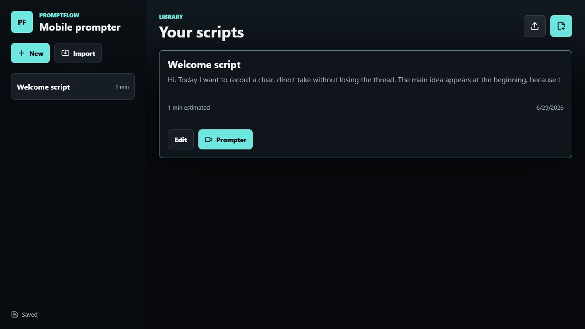
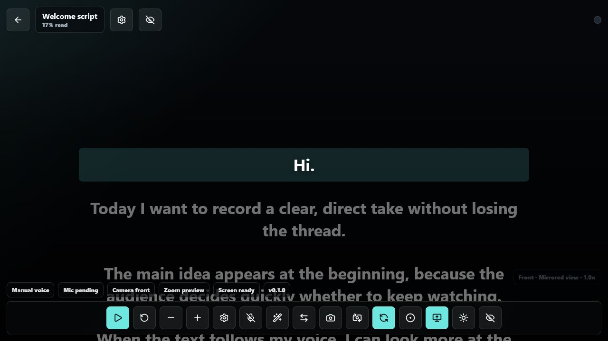

# PromptFlow

PromptFlow is a mobile-first teleprompter PWA for recording yourself while reading a script. It combines large readable text, camera preview, browser recording, local script storage, and optional voice-following when the browser supports it.

**Live app:** [alexmnrs.github.io/PromptFlow](https://alexmnrs.github.io/PromptFlow/)

## Screenshots





## Why It Exists

Recording a clear take from a phone or laptop is harder than it should be: the script is usually in one place, the camera in another, and rerecording breaks concentration. PromptFlow keeps the script, camera preview, recording controls, and review flow together in one browser-based workspace.

Use it for:

- Short tutorials and product walkthroughs.
- Social video scripts.
- Course intros and lesson recordings.
- Internal updates where reading cleanly matters.
- Rehearsing talks without installing heavy desktop software.

## Status

PromptFlow is a functional MVP. The main reading and recording workflow is implemented, the app is installable as a PWA, and unsupported browser features degrade to manual controls instead of blocking the session.

The project is currently focused on reliability, mobile usability, browser compatibility, and clearer documentation.

## Quick Start

Try the hosted version first:

1. Open [alexmnrs.github.io/PromptFlow](https://alexmnrs.github.io/PromptFlow/).
2. Create or paste a script.
3. Allow camera and microphone access when prompted.
4. Choose overlay or split-screen mode.
5. Start reading, record a take, review it, and download the result.

Run locally:

```bash
npm install
npm run dev
```

Run checks before opening a pull request:

```bash
npm run lint
npm run build
```

Preview the production build:

```bash
npm run preview
```

## Features

- Create, edit, duplicate, delete, import, and export scripts.
- Automatic local saving with `localStorage`.
- Teleprompter view with overlay and split-screen layouts.
- Switch split-screen order between script-first and camera-first.
- Switch between front and rear cameras when the device allows it.
- Reading controls for play/pause, restart, previous/next line, font size, speed, language, and zoom.
- Mirrored camera preview and hardware zoom when supported, with preview zoom as a fallback.
- Recording countdown, in-browser recording with `MediaRecorder`, and local download.
- Quick review of the recorded take, plus native sharing when supported.
- Optional Wake Lock to keep the screen awake while reading or recording.
- Optional voice-following with large manual controls as a fallback.
- Installable/offline PWA support through the manifest and service worker.

## Browser Support

Camera, microphone, recording, and speech recognition require a secure context. Use HTTPS in production. For local development, `localhost` works; for testing on a real iPhone, an HTTPS tunnel is usually the easiest path.

PromptFlow uses these browser APIs:

- `getUserMedia` for camera and microphone access.
- `MediaRecorder` for recording in the browser.
- `SpeechRecognition` or `webkitSpeechRecognition` for voice-following.
- Wake Lock and `navigator.share` as optional enhancements.

If voice-following is not supported, the app still provides large manual controls to move through the script.

Recording captures the camera and microphone stream. The prompter text is used as an on-screen reading guide and is not burned into the exported video.

## Project Roadmap

Near-term improvements:

- Improve mobile layout testing across common viewport sizes.
- Add a lightweight smoke test for the main script and recording workflow.
- Expand browser compatibility notes with tested browser/device combinations.
- Improve issue labels and contributor-friendly tasks.

Later ideas:

- Script templates for common recording formats.
- Better keyboard shortcuts for desktop recording.
- Optional export/import bundles for script collections.
- More polished recording review and retake management.

## Deployment

The project uses Vite with `base: './'`, so the generated `dist/` build works well on subpath deployments such as GitHub Pages.

The CI workflow in `.github/workflows/ci.yml` runs `npm ci`, `npm run lint`, and `npm run build` on every push or pull request targeting `main`.

To publish the PWA with GitHub Pages, enable Pages with GitHub Actions or deploy the contents of `dist/` from the workflow you prefer.

## Public Repository Notes

- `node_modules/`, `dist/`, `.tools/`, `.env*`, logs, and `*.tsbuildinfo` files are ignored.
- There is no automated test suite beyond linting and production builds yet.
- The project is released under the MIT License.
- Security and privacy guidance is documented in [SECURITY.md](SECURITY.md).

## Contributing

Small, focused improvements are welcome. Good first areas include documentation clarity, browser compatibility notes, mobile layout fixes, and lightweight tests around the main user workflow.

See [CONTRIBUTING.md](CONTRIBUTING.md) for setup instructions, pull request guidelines, and browser testing notes.

Before proposing a change, please run:

```bash
npm run lint
npm run build
```

## License

[MIT](LICENSE)
